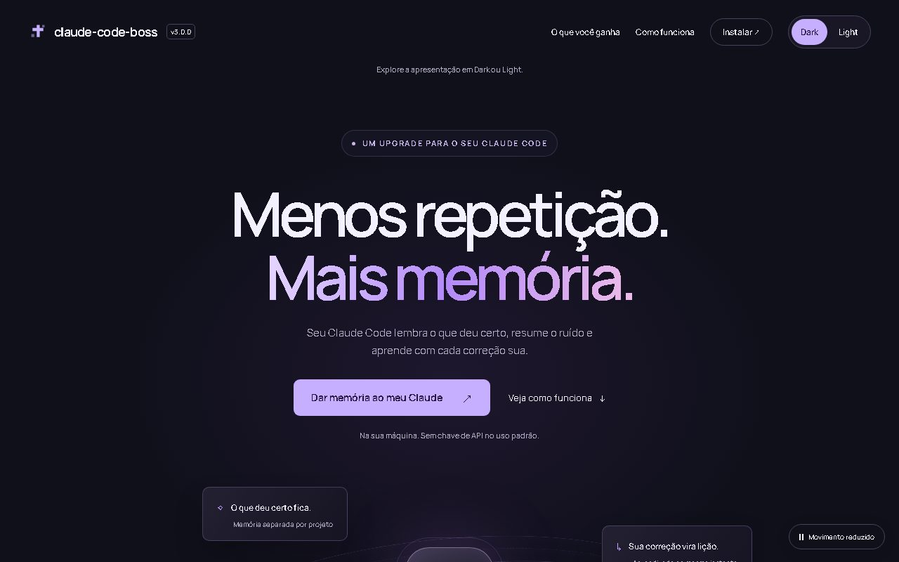
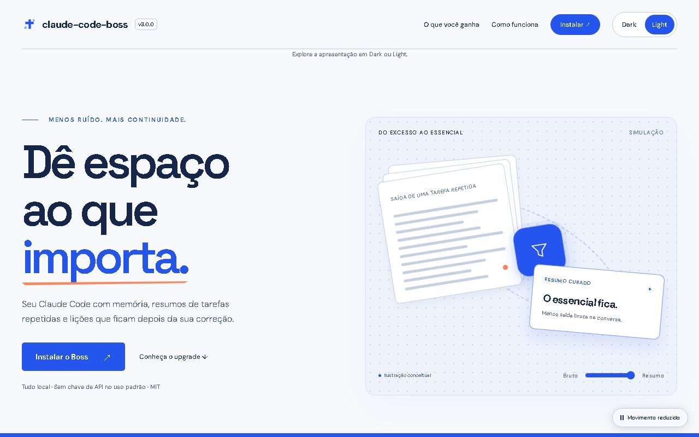
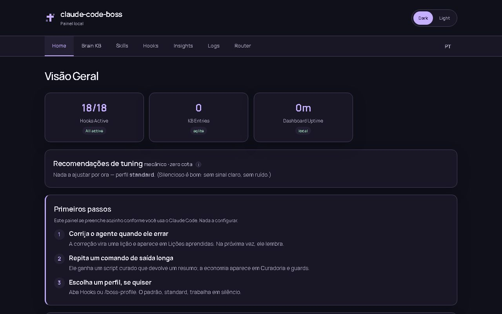

# claude-code-boss

Plugin para Claude Code Desktop — **v3.2.1**

**Menos repetição. Mais memória.** Com o claude-code-boss, o seu Claude Code lembra o
que deu certo e errado em cada projeto, resume a saída barulhenta de comandos que se
repetem e guarda uma lição toda vez que você o corrige. Tudo roda na sua máquina, sem
chave de API.

| Dark | Light |
| :-: | :-: |
|  |  |

**[Página do produto](https://allansantos-dv.github.io/claude-code-plugins/claude-code-boss/)** · [Detalhes técnicos](https://allansantos-dv.github.io/claude-code-plugins/claude-code-boss/tech.html) · [Changelog](CHANGELOG.md)

## Instalar em dois comandos

No Claude Code:

```
/plugin marketplace add AllanSantos-DV/claude-code-plugins
/plugin install claude-code-boss@allansantos-plugins
```

Precisa do **Node.js 22.13+ no PATH do sistema** (detalhes em [Pré-requisitos](#pré-requisitos)).
No primeiro prompt depois de instalar, uma mensagem confirma que o plugin está ativo.
Nada mais a configurar.

## O que você ganha

- **Ele lembra.** Cada projeto tem a sua memória. As lições certas entram na conversa
  sozinhas, e um prompt em português encontra uma lição escrita em inglês.
- **Ele resume.** Um comando que se repete e enche a tela ganha um script que devolve
  só o resumo. A sessão começa dizendo quanto isso economizou.
- **Ele aprende.** Quando você corrige o agente, a correção vira uma lição na hora. Lição
  que se repete fica mais forte, e o mesmo erro não roda duas vezes à toa.
- **Ele compacta na hora certa.** Quando o contexto passa do limite que você escolhe (um % da janela
  do modelo, no slider do painel) e o cache do provedor já expirou, o próximo prompt que você manda é segurado, o histórico é podado (seus pedidos e as
  respostas ficam palavra por palavra; saem só resultados de ferramenta velhos) e o mesmo prompt
  segue. Sem resumo, sem gastar token, e o painel mostra quanto foi cortado e o que o cache fez.
- **Painel em 0 turnos.** Digite `/dashboard`: o painel abre no navegador sem passar
  pelo modelo, nos temas Dark e Light. Numa instalação nova, ele mostra os primeiros passos.



---

# Documentação técnica

Brain KB (busca semântica), execução curada (anti context-bloat) e aprendizado leve para Claude Code. A orquestração fica a cargo das ferramentas nativas (Agent/Workflow) — o plugin foca no que o nativo não tem.

## Pré-requisitos

- [Claude Code Desktop](https://claude.ai/download)
- **Node.js 22.13+ no `PATH` do sistema** — requisito #1. O Claude Code dispara os
  hooks e o servidor MCP com `node` puro resolvido pelo **PATH do sistema**, **não**
  pelo Node embutido no Desktop ([claude-code#66183](https://github.com/anthropics/claude-code/issues/66183),
  [#35175](https://github.com/anthropics/claude-code/issues/35175)). Sem Node no
  PATH: os hooks viram no-op silencioso e o Brain MCP fica **DOWN** (`spawn node
  ENOENT`). No Windows, instale o MSI oficial e **feche o Claude Code por completo
  (tray + Gerenciador de Tarefas) e reabra** para herdar o PATH. Usa o `node:sqlite`
  nativo; em Node mais antigo o Brain cai no fallback JSON — **sem compilação nativa
  em nenhum caso**. Troubleshooting completo: skill `plugin-install`.
- (Opcional) Java 21+ para backend MCP Memory
- (Opcional) Ollama para embeddings locais via GPU

## Instalação manual (desenvolvimento)

Para uso normal, instale pelo marketplace ([dois comandos](#instalar-em-dois-comandos)).
O caminho abaixo é para quem desenvolve o plugin a partir do repositório.

```bash
cd claude-code-boss
npm install
```

O `npm install` (postinstall) **baixa o modelo de embedding** (~100-200 MB, uma vez) para um cache durável em `<CLAUDE_PLUGIN_DATA>/models/` (default `~/.claude/plugins/data/claude-code-boss/models/`) — habilita o search semântico **e** o loop de aprendizado (pattern→skill). Internet é assumida (você já baixou o plugin online). Pular (CI/automação): `CLAUDE_SKIP_EMBED_WARM=1`. (Re)baixar depois: `npm run setup:brain`.

Registre o plugin:

1. Abra Claude Code Desktop
2. Vá em **Settings → Plugins → Add local plugin**
3. Aponte para `.claude-plugin/plugin.json` neste diretório

Configure a variável de ambiente obrigatória para os hooks:

```bash
# ~/.bashrc, ~/.zshrc ou ~/.profile
export CLAUDE_PLUGIN_ROOT="/caminho/para/claude-code-boss"
```

## Estrutura

```text
claude-code-boss/
├── .claude-plugin/
│   └── plugin.json            # Manifesto do plugin (versão canônica)
├── .mcp.json                  # Servidor MCP: brain-server
├── config/
│   ├── brain-config.json      # Provider de embedding, backend (local|mcp-memory), thresholds
│   └── hooks-config.json      # Configuração dos hooks (memoryRotate, curationGuard, etc.)
├── dashboard/
│   └── index.html             # SPA — 4 abas: Home / Brain KB / Hooks / Logs
├── hooks/
│   └── hooks.json             # 8 eventos; 13 hooks `mcp_tool` (hook_*) rodam no daemon do brain-server + brain_retrieve_context; ficam como command só SessionStart (dispatcher de 12 + model-router-ensure.js) e user-prompt-submit-dispatcher (4, inclui model-router-ensure)
├── scripts/                   # Scripts Node.js (zero deps extras para hooks)
│   ├── dashboard.js           # Servidor HTTP local com ring buffer de logs
│   ├── brain-*.js             # Brain KB: store, index, graph, embedder, backend, CLI, consolidate (higiene)
│   ├── curation-guard.js      # PreToolUse: redireciona comandos de tarefa ao script curado; molda exploração
│   ├── stop-dispatcher.js     # Stop: roda todos os detectores in-process (via mcp_tool hook_stop_dispatcher, no daemon)
│   ├── doctor.js              # CLI + dashboard: diagnóstico zero-config (Node/PATH, data-dirs, daemon, hooks)
│   ├── hook-logger.js         # Utilitário: append a .runtime/hook-errors.jsonl
│   └── sync-version.js        # Propaga versão para todos os arquivos de versão
├── servers/
│   └── brain-server/          # MCP server (daemon HTTP único, porta fixa) — ver servers/brain-server/README.md
├── skills/                    # skills do Claude Code (inclui plugin-install)
├── package.json               # scripts: test, version:sync
└── TASK-MAP.md                # Histórico de entrega (parcialmente obsoleto pós slim-down)
```

## Hooks Pipeline

Todos os hooks estão declarados em `hooks/hooks.json`. Por evento, cada script
roda **num único processo Node por hook** — os detectores de cada evento são
consolidados num *dispatcher* in-process (mesmo padrão do `stop-dispatcher.js`
original): lê o payload uma vez, roda cada `run(event)` puro, funde o
resultado. `model-router-ensure.js` fica de fora do dispatcher de
`SessionStart` (spawn próprio; faz esperas reais de vários segundos na troca de
daemon). No `UserPromptSubmit` ele roda dentro do `user-prompt-submit-dispatcher`
(`run()` sem `process.exit`, com teto próprio): 1 processo por prompt, não 2.

**Desde a 2.29.1 (ADR-015)** a maioria desses hooks nem sobe processo: o
`hooks.json` declara um `mcp_tool` `hook_<nome>` do brain-server, que roda o
mesmo script in-process no daemon HTTP compartilhado (porta padrão 38217).
Medido: 8,9 ms p50 por hook (antes 122 ms com spawn) e 60 hooks concorrentes em
0,6–1,9 s (antes 7–8 s), com 234 MB no daemon em vez de ~3,9 GB somados. Uma
exceção na tool vira `systemMessage` de degradação (fail-open visível); com o
daemon fora do ar o Claude Code trata o `mcp_tool` como erro não bloqueante.
Ficam como `command` os hooks que precisam funcionar sem o daemon: `SessionStart`,
`user-prompt-submit-dispatcher` (que inclui o `model-router-ensure`). O `SubagentStart`
(`policy-inject`) também roda no daemon (`hook_policy_inject`): era 1 processo por
subagente. No daemon, `Stop` e os hooks de efeito colateral de `PostToolUse` rodam
num worker próprio (fila FIFO), fora da thread que atende os guards; os que
sempre devolvem `{}` respondem na hora e rodam em segundo plano; cada hook tem um
prazo interno de `timeout − 1 s`.

| Evento | Script | O que faz |
| --- | --- | --- |
| SessionStart | `model-router-ensure.js` | Garante o daemon do model-router na porta fixa e publica `ANTHROPIC_BASE_URL`/shim (roteamento de custo opcional) — spawn próprio, fora do dispatcher |
| **SessionStart** | **`session-start-dispatcher.js`** | **Entry único** — roda in-process os 13 detectores abaixo (`brain-daemon-ensure` + os 12 seguintes), concorrente com timeout próprio por detector (mirror dos timeouts antigos), funde os textos de advisory num só `additionalContext` |
| SessionStart (via dispatcher) | `brain-daemon-ensure.js` | Garante o daemon único e, no backend `mcp-memory` HTTP, verifica update no máximo 1x/24h; aplica/reinicia/valida versão automaticamente sem criar outro hook |
| SessionStart (via dispatcher) | `memory-rotate.js` | Rotaciona MEMORY.md quando >150 linhas (side-effect only) |
| SessionStart (via dispatcher) | `session-whitelist.js` | Detecta ecossistema do projeto, popula whitelist (side-effect only) |
| SessionStart (via dispatcher) | `brain-health.js` | Liveness probe (static + active backend.init/count): se MCP estiver caído, injeta advisory acionável; avisa também quando um hook do daemon fica **sem folga** (p95 ≥ metade do prazo, ou prazo estourado — 1×/hook/6 h); senão, silencioso |
| SessionStart (via dispatcher) | `project-snapshot.js` | Snapshot do estado do repo (branch/PRs/CI) via `git`/`gh`, cacheado 5min |
| SessionStart (via dispatcher) | `curation-session.js` | Poda one-hits antigos e injeta panorama de scripts curados; dispara higiene semanal do KB (fire-and-forget) |
| SessionStart (via dispatcher) | `doctor-advisory.js` | Roda `doctor.js` com cooldown; advisory de 1 linha só se algo crítico falhar (Node/PATH, data-dir fragmentado, daemon, token) |
| SessionStart (via dispatcher) | `review-checklist-advisory.js` | Se existir `.claude/brain-review-checklist.md` (lições recorrentes de código), lembra o `/code-review` nativo de consultá-lo |
| SessionStart (via dispatcher) | `value-digest.js` | 1×/dia por projeto: uma linha com o que a curadoria economizou nos últimos 7 dias (moldador + redirects), redirects, execuções, custo cru e o maior gargalo; silencioso sem atividade |
| SessionStart (via dispatcher) | `tuning-advisory.js` | Recomendação determinística de tuning (perfil/curadoria) com cooldown de 6h |
| SessionStart + UserPromptSubmit (via dispatchers) | `project-identity-advisory.js` | Pasta sem project id (e sem recusa `.memory/memory-off.json`) → avisa que a memória está desligada; o agente examina a pasta, lista os projetos (`project_list`), pergunta "novo ou continuação?" e grava com `project_set` |
| SessionStart (via dispatcher) | `backend-onboarding-advisory.js` | Backend `local` → diz ao agente o que fica desligado (grafo, compose, ingestão) e que ele pode ativar o servidor de memória com `backend_setup`. Só contexto do agente |
| SessionStart (via dispatcher) | `graph-warm.js` | mcp-memory: dispara um `ingest` incremental do Session Graph (fire-and-forget, cooldown por projeto) pra o grafo ficar pronto-e-fresco antes da 1ª busca — o servidor faz o delta (no-op ~5s se nada mudou). Silencioso, fail-open |
| SessionStart (via dispatcher) | `policy-inject.js` | Injeta as políticas standing (always) no contexto da sessão |
| SubagentStart | `policy-inject.js` | Injeta as políticas standing (always) no contexto próprio do subagente — mesma injeção do SessionStart (via `mcp_tool` `hook_policy_inject` no daemon, sem spawn por subagente) |
| PreToolUse (Bash) | `mcp_tool` → `hook_curation_guard` (`curation-guard.js`) | **Redireciona** (reescreve via `updatedInput`) cada parte de TAREFA cuja assinatura + flags casam com um alias curado para o script, inclusive dentro de compostos — `allow` em `bypassPermissions`, `ask` nos demais modos (o prompt mostra a reescrita); avisa o modelo e oferece `CCB_RAW=1` para a saída crua. Variantes não cobertas rodam cruas e são medidas. Rodar o próprio script curado (com ou sem pipe) nunca é barrado — o pipe é medido como sinal de que o script precisa de ajuste. Sem Token Guard instalado e em `bypassPermissions`, um comando de EXPLORAÇÃO isolado e sem pipe próprio (`cat`, `grep`, `git log`…; nunca `tail -f`/`less`) tem a saída limitada em streaming pelo `shape-output.js` (completa salva em `.runtime/shaped`). Fora das reescritas o guard **se abstém** (`{}`) — nunca responde `allow`, que pularia o sistema de permissões: o fluxo de permissões do usuário decide. Inclui o graph-guard p/ `grep -r`/`rg`/`find` amplos (mcp-memory + grafo ready → deny-once com redirect ao grafo) |
| PreToolUse (Bash) | `mcp_tool` → `hook_error_guard` (`error-guard.js`) | Nega o comando que já falhou ≥N vezes NESTA sessão, no mesmo diretório, sem nenhuma edição de arquivo desde a última falha — injeta a última saída. Repetir não desbloqueia; um sucesso ou uma edição (tentativa de correção) sim. Roda em paralelo ao `hook_curation_guard`; `deny` vence (o `pretooluse-bash-dispatcher.js` segue como entry por stdin, com a mesma regra) |
| PreToolUse (Edit) | `mcp_tool` → `hook_policy_enforce_shadow` (`policy-enforce-shadow.js`) | Shadow-mode: detecta se uma edição viola uma política de código ativa (sem bloquear ainda) |
| PreToolUse (Grep\|Glob) | `mcp_tool` → `hook_graph_guard` (`graph-guard.js`) | Busca recursiva ampla com Session Graph READY → deny-once: `graph_search`/`graph_symbols` primeiro (estrutural, ~300ms), depois re-rodar escopado; retry idêntico passa |
| **PostToolUse (Bash)** | **`mcp_tool` → `hook_posttoolusebash_dispatcher` (`posttoolusebash-dispatcher.js`)** | **Entry único** — roda `curation-detect.js` + `decision-detect.js` in-process (side-effect only, sempre `{}`) |
| PostToolUse (Bash, via dispatcher) | `curation-detect.js` | Detecta saída volumosa de comandos de TAREFA (exploração e código inline nunca viram script); a 1ª ocorrência fica pendente, a curadoria é pedida só quando o comando se repete — e, se for uma **variante** de um script existente, pede para **estender** esse script (EXTEND) em vez de criar outro; execução `CCB_RAW=1` nunca é cobrada; o mesmo script curado filtrado do mesmo jeito 2× (`| tail -3`) gera **um** pedido para embutir o filtro no script; mede execuções dos scripts curados |
| PostToolUse (Bash, via dispatcher) | `decision-detect.js` | Detecta commit/PR com cara de decisão arquitetural e stash pending para o Stop promover |
| PostToolUse (Edit\|Write\|NotebookEdit) | `mcp_tool` → `hook_file_edit_detect` (`file-edit-detect.js`) | Journala arquivos editados no turno (alimenta `verify-nudge` e `self-review`) |
| PostToolUse (Edit\|Write\|MultiEdit\|NotebookEdit) | `mcp_tool` → `hook_policy_glob_inject` (`policy-glob-inject.js`) | Injeta advisory de política glob (per-file) quando o arquivo editado casa um padrão de política ativa |
| UserPromptExpansion | `dashboard-command.js` (command, matcher `dashboard`) | **`/dashboard` sem LLM**: garante o dashboard no ar (sonda HTTP da porta publicada), abre o navegador e **bloqueia** a expansão mostrando a URL — o prompt nunca chega ao modelo; falha também bloqueia, com a causa |
| UserPromptExpansion | `mcp_tool` → `hook_skill_metric` (`skill-metric.js`) | Métrica de uso de skill (matcher `.*`) |
| **PostToolUseFailure** | **`mcp_tool` → `hook_posttoolusefailure_dispatcher` (`posttoolusefailure-dispatcher.js`)** | **Entry único** — roda `curation-detect.js` (já filtra `tool_name==='Bash'` internamente) + `failure-detect.js` in-process |
| PostToolUseFailure (via dispatcher) | `failure-detect.js` | Journala a falha (alimenta `failure-retro`). O `error-guard` não depende mais dele: decide pelo transcript da própria sessão (`lib/session-failures.js`) |
| **Stop** | **`mcp_tool` → `hook_stop_dispatcher` (`stop-dispatcher.js`)** | **Entry único** — roda in-process no daemon, em ordem, todos os detectores abaixo e funde os blocks num só `{decision:'block', reason}` |
| Stop (via dispatcher) | `pattern-detect.js` | Nudge advisory (throttled): capturar padrão reusável via `capture_lesson` |
| Stop (via dispatcher) | `self-review.js` | Se o turno editou arquivos, recupera lições/failures relevantes do Brain (daemon HTTP autenticado, fallback keyword) e injeta advisory — "você já errou X nisso antes" |
| Stop (via dispatcher) | `verify-nudge.js` | Se o turno editou arquivos e nenhum comando de teste/lint rodou, injeta 1 advisory (cap por sessão, sem escalonamento) |
| Stop (via dispatcher) | `refine-research.js` | Injeta lembrete de pesquisa (web → Brain → usuário) |
| Stop (via dispatcher) | `project-id-stop.js` | Pasta sem project id → bloqueia 1×/turno pedindo para definir o id (memória desligada até lá); silencia os detectores que pedem captura |
| Stop (via dispatcher) | `curation-stop.js` | Pede script curado (ou marcação de uso único) para comandos de tarefa ruidosos e recorrentes do turno, e ajuste de um script curado cuja execução solo saiu ruidosa (escalating, anti-loop) |
| Stop (via dispatcher) | `session-summary.js` | Cap 1/sessão: resumo positivo ("N lições capturadas") quando a sessão gerou aprendizado |
| Stop (via dispatcher) | + 7 outros | `skill-promote-trigger`, `decision-scan-response`, `decision-promote`, `research-followup-detect`, `failure-retro`, `skill-success-detect`, `retrieval-feedback`, `auto-continue-stop` — mesmo comportamento de antes, agora in-process |
| UserPromptSubmit | `model-router-ensure.js` | Mesma garantia de daemon do model-router, agora por-turno (settings/env já publicados no SessionStart) — roda dentro do `user-prompt-submit-dispatcher` (mesmo processo) |
| **UserPromptSubmit** | **`user-prompt-submit-dispatcher.js`** | **Entry único** (command, funciona com o daemon fora do ar) — antes de tudo atende `/dashboard` digitado (o nome curto que a CLI não resolve chega aqui como texto) do mesmo jeito, sem LLM; depois roda in-process os 3 detectores abaixo, concorrente com timeout próprio por detector, funde os textos de advisory num só `additionalContext` |
| UserPromptSubmit (via dispatcher) | `brain-daemon-ensure.js` | Mesma garantia de daemon do SessionStart — captura o daemon caído em sessões resumidas |
| UserPromptSubmit (via dispatcher) | `brain-health.js` | Mesma probe do SessionStart, com cooldown de 60s — captura MCP caído em sessões resumidas |
| UserPromptSubmit (via dispatcher) | `brain-status.js` | Advisory só quando o backend `mcp-memory` está desconectado (silencioso no backend `local`, sempre conectado por design) |
| UserPromptSubmit | `mcp_tool` → `hook_correction_detect` (`correction-detect.js`) | Detecta sinal de correção → nudge p/ `capture_lesson` (sem ler transcript) |
| UserPromptSubmit | `mcp_tool` → `hook_active_research_detect` (`active-research-detect.js`) | Detecta prompt com sinais de pesquisa externa (lib/versão/best-practice) → nudge p/ `research_query` |
| UserPromptSubmit | `mcp_tool` → `brain_retrieve_context` | Retrieval QUENTE por-turno: embeda o prompt no brain-server (warm ~12–26ms), gate 0.20, federa `__user__`, injeta bloco `[BRAIN]` (substitui o antigo `brain-retrieve-prompt.js`) |

> **Captura de lição in-loop:** quando o usuário corrige, o agente (no loop, com
> contexto completo) chama a tool MCP **`capture_lesson`** com a lição curada — que
> roda admission control inline (dedup/merge → `recurrence`). **Sem reler transcript,
> sem subagente caro.** Os hooks só dão o nudge.
>
> **Tom advisory:** os hooks informam, não coagem. Sem orquestrador próprio:
> a delegação usa as ferramentas nativas (Agent/Workflow).
>
> **Perfis (`hooks-config.json` → `profile`)** — um único eixo de enforcement, três modos:
> - **`standard`** (padrão) — silencioso, mas **aprende**: só a curadoria dá **1 aviso
>   soft** e relenta. O `correction-detect` (nudge de captura **silencioso** no
>   UserPromptSubmit, invisível ao usuário) fica **LIGADO** — o perfil quieto não mata o
>   auto-aprendizado (v2.9.0). Ficam desligados os nudges **interruptivos** e as
>   ferramentas de dev: `pattern-detect`, `decisionScan`, `verifyNudge`, `selfReview`,
>   `refine-research`, `failure-retro`, `research-followup`, `auto-continue`.
>   `session-summary` (1×/sessão) e o retrieval continuam.
> - **`dev`** — tudo ligado (curadoria escala até 3×), para quem estende o plugin.
> - **`free`** — passa tudo: o Stop-dispatcher faz short-circuit e **nada bloqueia**;
>   só o retrieval de contexto no prompt (read-only) segue ativo.
>
> **Troca update-safe:** o perfil é lido do config shipped **mesclado** com
> `DATA_DIR/hooks/user-config.json` (nunca versionado), então trocar não edita arquivo
> versionado e **sobrevive ao auto-update**. Use o comando **`/boss-profile <dev|standard|free>`**
> ou o seletor na aba **Hooks** do dashboard. Override individual em `hooks-config.json`
> ainda vence o preset. Vale a partir do próximo turno (sem reiniciar o Claude Code).

## Compactação controlada

Módulo de *function hook* do Claude Code (`hooks/compaction.mjs`, declarado em `modules` no
`hooks.json`; exige Claude Code 2.1.274+). Decisões puras em `scripts/lib/compaction-core.mjs`
(ESM, usado pelo módulo e pelo Node).

- **Quando**: nunca sozinho e **nunca com o cache quente**. No `prompt.submit` de uma pessoa com a
  sessão ociosa, se o contexto passou do limiar **e** o cache do provedor já expirou, o prompt é
  segurado, o `/compact` roda e o mesmo texto é reenviado como seu. Com o cache válido ele espera —
  reescrever o histórico regravaria no cache o que ainda está pago; se o cache nunca esfriar, quem age é a
  compactação automática do próprio engine no limite dela (que também passa pela poda).
- **Limiar**: um % (`thresholdPercent`, padrão 30, faixa 10–80) da janela que o engine aplica naquele
  prompt — o limite do modelo ou uma janela de compactação menor (`CLAUDE_CODE_AUTO_COMPACT_WINDOW`) —, então
  o mesmo ajuste serve a modelos de 200K e de 1M e acompanha o `/model`. Um limiar além do ponto de
  auto-compact do engine é sinalizado (o engine compactaria antes). Ajuste no slider do painel
  **Compaction & cache** (gravado em `~/.claude/claude-code-boss/hooks/user-config.json`, sobrevive a
  updates; sessões abertas pegam no próximo turno).
  A validade é a **observada** nas respostas reais de cada host (`ephemeral_5m` / `ephemeral_1h`;
  medido: assinatura 1 h, um gateway de API 5 min); sem observação, assume a mais longa.
- **O quê**: toda compactação (manual, o limiar automático do engine, a do gate) passa pela poda:
  texto de usuário e assistente intacto; resultados de ferramenta superados (leitura refeita,
  comando que falhou e depois passou, saída grande antiga) truncados com uma nota do motivo. Pouco a
  cortar → o resumo do próprio engine.
- **Retomada** (`--resume`, `-c`): depois de uma compactação feita por hook o engine recarrega o
  histórico original com as cópias intercaladas (a API passava a ver cada tool_use duas vezes e
  rejeitava o thinking). O primeiro prompt detecta as cópias e poda antes de qualquer envio.
- **Não age** em sessão headless (`-p`/SDK: o engine não deixa um plugin compactar ali — o `/compact`
  manual e o limiar automático continuam passando pela poda), no perfil `free`, nem com
  `compaction.enabled: false`. Config em `hooks-config.json` → `compaction` (`thresholdPercent` 30,
  `minIntervalMinutes` 10, `preserveRecentMessages` 6); `GET/PUT /api/compaction/config`.
- **Observabilidade**: o módulo envia cada evento ao daemon (`POST /hook/compaction-event`, mesmo
  token do `/mcp`) → metrics store: `compaction.gate` (decisão e motivo, idade e TTL do cache),
  `compaction.run` (gatilho, caracteres cortados, cópias do engine removidas), `compaction.settled`
  (tokens antes/depois, medidos no turno seguinte), `compaction.resume`, `compaction.error` e
  `cache.turn` (por chamada de API: host, tipo de credencial, modelo, cache lido/gravado, janela
  contratada, primeira chamada depois de uma compactação). Painel **Compaction & cache** na Home,
  `GET /api/metrics/compaction` e o log de eventos do Insights.

## Brain KB

Base de conhecimento local com 3 layers:

1. **Storage** (`brain-store.js`) — SQLite via `node:sqlite` (built-in do Node 22.13+, **zero deps nativas**) com fallback automático para `better-sqlite3` (se instalado) e, por fim, JSON. Busca vetorial (cosine similarity JS, suficiente para <10K entradas), FTS keyword search
2. **Index** (`brain-index.js`) — Índice invertido de palavras-chave com TF scoring
3. **Graph** (`brain-graph.js`) — Grafo de citação com 6 tipos de aresta

**Providers de embedding** (configurável em `config/brain-config.json`):

| Provider | Config | Requisito | Custo |
| --- | --- | --- | --- |
| `transformers` (padrão) | `embedder.provider: "transformers"` | Zero build; baixa o modelo (~100-200 MB) no install | Zero |
| `ollama` | `embedder.provider: "ollama"` | Ollama rodando localmente | Zero |
| `voyage` | `embedder.provider: "voyage"` | Chave API Voyage AI | ~$0.10/1M tokens |

**Modelo padrão**: `Xenova/paraphrase-multilingual-MiniLM-L12-v2` (384-dim, 50 idiomas) — recupera lessons EN a partir de prompts em qualquer idioma suportado. Baixado automaticamente no `npm install` para um cache durável (`<CLAUDE_PLUGIN_DATA>/models/`, sobrevive a reinstalls); refaça/verifique com `npm run setup:brain`.

**Breaking change — cutover de modelo**: ao trocar o `embedder.model`, vetores antigos ficam incompatíveis. Rode uma vez:
```bash
node claude-code-boss/scripts/brain-reembed.js
```
O script wipa a tabela `embeddings` de todo project DB e re-embeda usando o modelo atual. Sem fallback, sem `previousModel`, sem dual-read — plugin é single-tenant.

**Servidor de memória (mcp-memory) — o agente instala para você**: grafo de código
(`graph_*`), recall em dois níveis (`compose_recall`) e ingestão de conversa exigem o
servidor de memória (native-java). No backend `local` o agente é avisado do que está
desligado; basta pedir "ative o servidor de memória do boss". O servidor é iniciado só pelo inicializador oficial dele (`~/.mcp-memory/bin/mcp-memory-daemon`, que o boss instala uma vez e que também liga o servidor no logon); o plugin nunca sobe o jar por conta própria. Primeiro ele pergunta se você já roda um servidor em outro host (com o endereço, só aponta para ele — nada é instalado); se você não souber, reaproveita o servidor que já roda na máquina (plugins irmãos instalam um; nunca sobe um segundo) ou o que outro plugin já instalou, e só baixa se não houver nenhum. Ele mostra a versão do servidor e atualiza só com o seu OK (`backend_update`). Usa as tools
`backend_status` (o que está instalado e rodando), `backend_setup` (confere Java 21+ —
se faltar, devolve o comando de instalação do seu sistema —, baixa o servidor, sobe em
modo daemon e troca o backend) e `backend_setup_status` (progresso). Ao terminar, o
serviço do brain reinicia para carregar o backend novo e as sessões reconectam sozinhas.
A primeira subida do servidor baixa o modelo de embeddings (~430 MB) e pode levar alguns
minutos.

**Pelo dashboard** (alternativa): abra o dashboard
(`node claude-code-boss/scripts/dashboard.js`) → aba **Brain** → **Backend
Configuration**. Escolha `mcp-memory`, modo **http** (conectar a um
mcp-memory-server já rodando; deixe a URL vazia para auto-descobrir via
`~/.mcp-memory/run/daemon.json`), e use **Testar conexão**. Opcional: ligue a
**ingestão** para enviar a conversa ao servidor (curadoria server-side) — é
opt-in e desligada por padrão. O ajuste é gravado só para você em
`DATA_DIR/brain/user-config.json` (o config publicado continua `local`) e
sobrevive ao auto-update. O modo **stdio** (o plugin sobe o `.jar`, requer
Java 21+) fica disponível como opção avançada.

No modo HTTP, o `SessionStart` também consulta as tools `check_update` e `update`
anunciadas pelo próprio servidor, no máximo uma vez a cada 24 horas. Quando há
release nova, a operação é chamada **uma única vez** (sem retry automático), o
Boss acompanha o restart pelo `daemon.json` e só registra sucesso quando
`/health.version` corresponde exatamente à versão esperada. SessionStarts
concorrentes são serializados por lock. Falha gera advisory, mas não bloqueia o
backend. O fluxo permanece dentro de `session-start-dispatcher.js`; nenhum hook
ou processo updater adicional é criado. No Windows, se a tool não conseguir
substituir o JAR em uso, o Boss valida o PID/comando Java, encerra o daemon,
promove o JAR já baixado e verificado e relança a versão nova; o JAR anterior é
mantido para rollback.

Por segurança, `serverUrl` remoto/de equipe **não** é atualizado automaticamente
por padrão. Esse caso exige `backend.mcpMemory.autoUpdate.allowRemote=true`; mesmo
com opt-in, o fallback Windows nunca usa o `daemon.json` local para um destino
explícito/remoto.

**Migrar o KB local que você já tem (botão "Migrar agora")**: trocar o backend
para `mcp-memory` **não leva junto** o que já estava no SQLite local — sem
migração, o acervo antigo fica órfão. No mesmo card (**Brain → Backend
Configuration**, visível só no modo `mcp-memory`) há **Migrar agora**: ele varre
todo projeto com KB local (`DATA_DIR/brain/<projeto>/brain.db`), lê cada entrada
inteira e a grava no servidor **projeto a projeto** (o daemon escopa por
`project_id` no handshake, um por conexão). A tela mostra o progresso e, no fim,
confere a contagem remota contra o que subiu.

- **Idempotente**: cada documento é gravado com `documentId` = o id local
  (`add_document` faz UPSERT), então rodar de novo **atualiza** em vez de
  duplicar. Seguro para retomar uma migração interrompida.
- **Fail-loud**: uma entrada que falha não aborta o resto, mas é coletada com a
  causa real e o resultado vira erro — nunca "sucesso" mascarando perda. Fora do
  backend `mcp-memory` a migração recusa rodar (jamais grava no store local em
  silêncio). Se a conferência final achar menos documentos no servidor do que
  subimos, isso também é reportado como erro.
- **O servidor re-embeda** cada entrada (o `add_document` manda o conteúdo, não
  os vetores), então um acervo grande leva tempo — daí o botão explícito com
  progresso, em vez de migrar sozinho ao salvar.
- **O que muda ao migrar** (trade-off honesto): a de-duplicação de lições passa a
  ser server-side (some o merge local que somava `recurrence`) e o `brain_related`
  deixa de usar o grafo de citação local, virando busca semântica. Em troca, as
  tools `graph_*` passam a funcionar (o grafo vive no servidor).
- **Limitação atual**: entradas de escopo **global** (`__user__`) ainda **não**
  migram. O servidor só aceita escrita global (escopo *home*/`skill_global`) sem
  um `project_id` ativo, e o handshake do cliente é sempre escopado num projeto
  por design (anti-contaminação). Migre-as manualmente ou aguarde o suporte.

Também dá para rodar pela linha de comando:
```bash
node claude-code-boss/scripts/brain-migrate.js
```

**Identidade do projeto (recall entre máquinas/pastas)**: o cliente escopa a
memória por um `projectId`, resolvido por uma escada **estrita** (sem fallback
para o nome da pasta):

1. variável de ambiente **`CCB_PROJECT_ID`** — força o id da sessão inteira;
2. **`.memory/project.json`** na pasta do projeto (ou em um ancestral), com
   `{"version":"1","metadata":{"defaults":{"project_id":"loja-online"}}}` —
   viaja com a pasta, **independe de git**, do nome da pasta e do path absoluto;
3. legado `.claude-boss-project` (deprecado, ainda honrado);
4. **git remote origin** normalizado;
5. nada → **a memória fica DESLIGADA nessa pasta** (2.29.1).

**Pasta sem id = sem memória** (mesmo modelo do plugin copilot-memory). Em uma
pasta sem id (ex.: exploração fora de um repo git) o boss **não injeta recall**
(`brain_retrieve_context` volta vazio e o `self-review` do Stop não roda) e **não
salva nada** (`capture_lesson`/`brain_store`/`brain_search` com `cwd` sem id são
recusados; o `cwd` com id vence um `project` explícito). O
`SessionStart` avisa o agente, o `UserPromptSubmit` repete o aviso **a cada prompt**
seu, e o `Stop` (`project-id-stop`) bloqueia uma vez por turno, sem loop — até o id
existir; nesse meio-tempo os detectores de Stop que pedem captura ficam em silêncio.
Para resolver, o agente examina a pasta, lista os projetos que já existem na memória
(`project_list`) e pergunta se é um projeto novo ou a continuação de um existente
(sugerindo o provável pelo conteúdo da pasta); com a sua resposta ele grava o nome com
`project_set` — que recusa um nome já existente a menos que você confirme que é o mesmo
projeto (`link: true`). Num repo git com remote o id é automático (`host/owner/repo`),
o mesmo em qualquer máquina ou caminho. **Se não quiser memória
nessa pasta**, recuse: o agente cria `.memory/memory-off.json` e os avisos param
(a memória segue desligada ali). Subpasta de um projeto declarado é coberta: o
`.memory/project.json` é procurado até 8 níveis acima, parando antes da sua pasta
home. Para desligar os avisos em todas as pastas: `onboarding.projectIdentity: false`
na config (a memória continua desligada sem id).

## Brain MCP: daemon único, zero processo por sessão (ADR-001)

O brain-server (`servers/brain-server/`) tem **um único modo**: um daemon HTTP de
longa duração (StreamableHTTP, *stateful*) numa **porta fixa** (`38217`),
compartilhado por toda sessão do Claude Code e qualquer outro consumidor na
máquina — **um modelo, um SQLite**. O `.mcp.json` aponta direto pra URL
(`"type":"http"`, sem `command`) — **Claude Code não spawna processo nenhum por
sessão**; cada sessão é um cliente HTTP fino do daemon único.

O daemon em si é garantido (encontrado-ou-iniciado) pelo `headersHelper` do
`.mcp.json` (`scripts/mcp-headers.js`), que o Claude Code roda ANTES de cada conexão
— a 1ª conexão já encontra o daemon de pé (antes, subido só pelo hook, ele chegava
depois da 1ª tentativa e os hooks `mcp_tool` do 1º turno eram pulados durante o
backoff do cliente) — e pelo hook `SessionStart`/`UserPromptSubmit`
(`scripts/brain-daemon-ensure.js`). Ambos efêmeros (rodam, garantem, saem).

- **Porta é FIXA** (`38217`, não derivada por data-dir), pra bater com a `url`
  estática do `.mcp.json`. Override com `--port` ou `BRAIN_HTTP_PORT`.
- `project` é **obrigatório** por chamada (não há CWD de sessão pra inferir — o
  daemon serve todos os projetos da máquina); sem `project`, rejeita
  (`PROJECT_REQUIRED`) em vez de cair em `'default'`.

**Auto-start + auto-upgrade**: o hook de ensure sobe o daemon sozinho (detached) e, a
cada atualização do plugin, **troca um daemon obsoleto pelo novo** (lock em
`DATA_DIR` + checagem de versão via `/health`). Desligue com `BRAIN_HTTP_AUTOSTART=0`.

**Consumir de fora do Claude Code** (ex.: OpenCode): aponte pra
`http://127.0.0.1:38217/mcp` (ou a porta fixada via `BRAIN_HTTP_PORT`), passando
`project` explícito e o header `Authorization: Bearer <token>` com o conteúdo de
`<DATA_DIR>/brain-http.token`.

**Auth**: `/mcp` e `/shutdown` exigem o token local (`<DATA_DIR>/brain-http.token`,
fixável via `BRAIN_HTTP_TOKEN` — o daemon mantém o arquivo igual ao valor fixado) além
da guarda de `Origin` (DNS rebinding); o Claude Code recebe o token pelo
`headersHelper`. `/health` permanece aberto (supervisão). Limite: o cliente MCP não
verifica quem atende a porta — um helper que falha não impede a conexão (medido no
2.1.283) — ver `docs/SECURITY.md`.

> **Referência técnica completa** (tools, endpoints, supervisor, config):
> [`servers/brain-server/README.md`](servers/brain-server/README.md).

## Graph — exploração de repositório (via daemon de memória)

7 tools `graph_*` (`graph_analyze`/`graph_search`/`graph_symbols`/`graph_status`/`graph_ingest`/`graph_callers`/`graph_references`) dão **exploração rápida de um repositório** — hubs por PageRank, busca semântica com vizinhança (CALLS/CONTAINS/IMPORTS), quem chama um símbolo — para entender um repo grande sem garimpar arquivo por arquivo. São **cliente REST puro** do Session Graph Engine do daemon native-java (`POST /api/v1/graph/*`): **nenhum Java é embarcado** e, se o daemon estiver offline, as tools **falham graciosamente** (fail-open). Path-autoritativo (o daemon deriva o `project_id` do caminho e o devolve). Ficam **fora** do KB/mutex — independentes do Brain KB local. Porta de entrada: `graph_analyze`. Ref. técnica: [`servers/brain-server/README.md`](servers/brain-server/README.md).

## Dashboard

Iniciado **sob demanda** (não mais no SessionStart). Configura o **plugin**
(brain-config, hooks). Abra com **`/dashboard`** — respondido por hook, **sem passar
pelo modelo** (zero turnos, zero tokens): sobe o dashboard se preciso, abre o navegador
e mostra a URL. Também: `node scripts/dashboard-start.js` (imprime `{ok, url}`).

- **Abas**: Home, Brain KB, Skills, Hooks, Insights, Logs, Router
- **Temas**: Dark (padrão) e Light, no seletor do topo; a escolha (`localStorage` `ccb-theme`) vale também para a página do produto e a página técnica
- **Instalação nova**: a Home mostra um cartão "Primeiros passos" enquanto não houver nenhuma atividade (lição, recall ou curadoria) e some com a primeira
- **Backup** (aba Brain): **Criar backup** guarda num único `.tar.gz` tudo o que o plugin aprendeu na máquina — memória local, métricas, curadoria, políticas, rascunhos de skill e configurações (os bancos SQLite em snapshot consistente, mesmo com o serviço rodando). Ficam de fora os modelos (baixados de novo), arquivos transitórios e segredos (tokens, chave NVIDIA). Criar e restaurar rodam em segundo plano, com o progresso na tela (com o servidor de memória incluído o arquivo pode ter GBs; tudo vai em fluxo para o disco). **Restaurar de arquivo** valida tudo antes, guarda o estado atual num backup `pre-restore` e reinicia o serviço de memória por um instante. Os arquivos ficam em `~/.claude/claude-code-boss/backups` (5 mais recentes). No backend `mcp-memory`, os dados do servidor entram quando ele oferecer as tools do [contrato de backup](docs/BACKUP-CONTRACT.md); até lá o backup diz explicitamente que não os inclui
- **Porta**: dinâmica (0 → auto-assign, sempre `127.0.0.1`); fixe com `DASHBOARD_PORT`
- **Auth**: token aleatório gerado no boot (salvo em `.runtime/dashboard.json`)
- **Logs tab**: ring buffer de 500 entradas + `hook-errors.jsonl` agregado. Auto-refresh a cada 2s, Copy JSON, Clear
- **Home tab**: cards de valor (tokens economizados pela curadoria, lições
  aprendidas, % de retrieval citado) + painel **Curation & guards** (economia
  exata do moldador / estimada dos redirects / custo da saída crua que entrou no
  contexto; por script: redirects, execuções, saída média, sucesso, variantes não
  cobertas, pipes; scripts que **nunca rodaram** na janela, com botão **Prune** — também pela tool `curation_prune_unused`; latência por hook do daemon) + card
  "learning loop" (capturadas vs. mescladas por semana) + botão de consolidação
  do KB (ver abaixo) + painel **Compaction & cache** (compactações por motivo, caracteres e tokens
  cortados, prompts segurados, retomadas repodadas, e por host de API: janela de cache observada,
  hit e o preço da primeira chamada depois de cada compactação).

## Endpoints custom — upstream e BYOK

> **💰 Cobrança**: o Model Router nasce **desativado** e ligá-lo é opt-in por conta
> e risco. Passthrough/sticky na rota Anthropic preserva a cobrança da assinatura;
> a rota BYOK e o fallback NVIDIA cobram o endpoint; uma `ANTHROPIC_API_KEY` no
> ambiente vira API pay-as-you-go. Guia completo:
> [docs/features/ROUTER-BILLING.md](docs/features/ROUTER-BILLING.md).

O proxy aceita gateways **Anthropic Messages** e **OpenAI Chat Completions**.
No dashboard você escolhe o protocolo e configura URLs completas, separadas para
modelos, geração, contagem de tokens e classificação. A mesma configuração pode
vir de variáveis de ambiente; a precedência é
`dashboard/user-config > ambiente > defaults`.

- **Anthropic**: encaminhamento nativo para a URL de geração configurada.
- **OpenAI**: a geração pode apontar para `/v1/chat/completions` ou qualquer path;
  o router traduz mensagens, ferramentas, imagens suportadas, respostas JSON e
  SSE. Campos incompatíveis falham explicitamente — nunca são omitidos em silêncio.
- **Picker `/model`**: IDs sem `claude`/`anthropic` recebem o alias
  `anthropic-ccb-alias-` apenas na listagem. O marcador é removido antes de enviar
  geração ou contagem ao endpoint; o `display_name` continua real.
- **Custom upstream** preserva a credencial do Claude Code e os
  `forwardHeaders`; **BYOK** remove essa credencial e envia somente os headers
  configurados pelo usuário.
- **Dois modos** (`/dashboard` → Model Router → BYOK):
  - **`on-limit`** (padrão) — o Claude atende normalmente e o endpoint entra
    quando a janela esgota (429), **antes** do plano B da NVIDIA. Se o endpoint
    também estiver no teto (429), a vez passa para a NVIDIA.
  - **`always`** — o endpoint atende **tudo**; não depende da assinatura Claude.
- **Fail-loud**: `401`/`404`/`5xx` e um corpo com `model is not supported` **não**
  caem em silêncio para a NVIDIA. Erro de configuração precisa aparecer, senão a
  credencial errada nunca é consertada.
- **Segurança — o ponto que mais importa**: o `authorization`/`x-api-key` que o
  Claude Code envia carrega o token da **sua assinatura**. Na rota BYOK esses
  headers são **removidos**; só vão os que você configurou. Repassá-los seria
  vazar a credencial da assinatura para um terceiro. Há um teste ponta a ponta
  que sobe um endpoint falso e falha se o token aparecer lá.
- Os headers ficam em `~/.claude/claude-code-boss/model-router/user-config.json` (permissão `0600`,
  nunca commitado) e a UI **não reexibe** os valores — mostra os nomes mascarados
  e mantém o que já está gravado quando você salva com o campo em branco.
- **Mapeamento de modelo** (opcional, só na rota BYOK): regras origem → destino
  trocam o `model` enviado ao endpoint. A ordem é: ID exato, depois o ID sem a
  data de snapshot (`-AAAAMMDD`), depois padrões com `*` (vence o que tem mais
  caracteres literais; empate, a regra que vem primeiro). Os padrões são
  testados contra o ID original, com a data: `claude-opus-*-2025*` casa
  `claude-opus-5-20250101`, e a base sem data não entra nessa etapa. Sem regra, o `model` vai como veio, e `claude-opus-5` nunca captura
  `claude-opus-5-5`. Para gateways que decidem a rota por outro campo, a
  **injeção** (desligada por padrão) grava o modelo resolvido num caminho do
  corpo ou num header via template `{model}`:

  ```json
  "byok": {
    "modelMap": {
      "claude-opus-5-5": "provedor.modelo-a",
      "claude-haiku-4-5": "provedor.modelo-b",
      "claude-sonnet-5-*": "provedor.modelo-c"
    },
    "modelInjection": { "body": { "metadata.force_model": "{model}" } }
  }
  ```

  Editável em `/dashboard` → Model Router → BYOK. Headers de credencial e de
  protocolo (`authorization`, `x-api-key`, `content-type`,
  `anthropic-version`, …), o próprio `model` e os campos de protocolo do corpo
  (`messages`, `system`, `tools`, `stream`, `max_tokens`, …) não podem ser alvo
  da injeção, e todo template precisa conter `{model}` (valor fixo é recusado).
  Nomes de header com cara de credencial (`auth`, `token`, `secret`,
  `api-key`, `cookie`, `session`, …) ou de roteamento (`Content-*`,
  `X-Original-*`, `X-Envoy-*`, `CF-*`, `*-Client-IP`, …) também são recusados
  (a lista é uma rede de segurança, não é exaustiva), e a injeção não sobrescreve um
  campo de topo que a request já traz nem cria chave que só difere de uma
  existente na caixa. **O template não é lugar
  de segredo**: aceita até 64 caracteres de texto fixo e o dashboard o exibe em
  claro. Credencial vai em *Headers*, que ficam mascarados. Uma request sem
  `model` de texto com injeção ligada falha em vez de enviar o campo vazio.
  Nomes de modelo com mais de 256 caracteres ou fora de ASCII visível nunca
  casam uma regra e seguem como vieram. O limite é de 500 regras. Se o arquivo de config tiver regra
  inválida (editado à mão), a aba mostra o erro e trava o salvar até você
  corrigir o arquivo (a mensagem mostra o caminho); o "Desligar tudo" continua funcionando.
- **Compatibilidade OpenAI Chat Completions** (opcional, só com
  `wireProtocol: "openai"` no BYOK): o padrão é o formato que um gateway
  passthrough aceita — assistant com tool calls e sem texto sai com `content: null`,
  `system` no meio do histórico fica na posição, e `tool_reference` dentro de
  `tool_result` vira texto JSON. Se o seu endpoint recusar algum desses casos,
  troque em `/dashboard` → BYOK → *Avançado: compatibilidade OpenAI Chat
  Completions* ou no arquivo:

  ```json
  "byok": {
    "openaiCompat": { "assistantEmptyContent": "empty", "systemInMessages": "reject", "toolReference": "reject" }
  }
  ```

  Valores (strings), com o padrão primeiro: `assistantEmptyContent`
  `"null"`/`"empty"`, `systemInMessages` `"keep"`/`"reject"`, `toolReference`
  `"text"`/`"reject"`. O exemplo acima troca os três.

  `"reject"` recusa a request citando a opção, sem chamar o endpoint: `400` no
  `mode: "always"`; no fallback (`on-limit`/cooldown) a resposta vira um aviso
  explicando por que a request não pôde ir ao BYOK. Valor ou chave desconhecida
  é erro de configuração, nunca default silencioso: no `always` a request falha
  com `502` citando a opção (o catálogo repassado também), e no fallback a
  resposta mostra a causa em vez de ceder à NVIDIA. O dashboard valida a opção mesmo com `wireProtocol:
  "anthropic"` (em que o router a ignora), para o erro não aparecer só ao trocar
  o protocolo.

## Diagnóstico e higiene do KB
- **`node scripts/doctor.js`** — checklist zero-config: Node no PATH + versão,
  `CLAUDE_PLUGIN_ROOT`/`CLAUDE_PLUGIN_DATA` resolvidos, **fragmentação de
  data-dir** (múltiplos `claude-code-boss*` populados sob
  `~/.claude/plugins/data/` — comum entre install via `--plugin-dir` e via
  marketplace), modelo de embedding presente, daemon HTTP + token legível, e
  quais eventos de `hooks.json` a versão instalada do Claude Code suporta.
  Mesmo diagnóstico acessível pelo dashboard (botão) e via advisory de
  SessionStart (só quando algo crítico falha, com cooldown).
- **`node scripts/brain-consolidate.js [--project <k>] [--apply]`** — funde
  lições quase-duplicadas (similaridade 0.7–0.9, mesmo tipo) num único
  sobrevivente somando `recurrence`; **dry-run por padrão**. Roda também
  semanalmente sozinho (cooldown via SessionStart) e tem botão dedicado na aba
  Home do dashboard.

## Versionamento

Fonte canônica: `package.json` → propagada via `sync-version.js` para:
- `.claude-plugin/plugin.json`
- `README.md` (raiz do repo)
- `claude-code-boss/README.md` (este arquivo)

```bash
# Bump de versão
node scripts/sync-version.js 1.4.0

# Validar que todos estão em sincronia
node scripts/sync-version.js --check
```

> `servers/*/package.json` têm versão independente (são pacotes MCP separados, não o plugin em si).

## Desenvolvimento

```bash
npm test           # testes de hooks
npm run version:sync  # Re-sincroniza versão sem bump
```

## Desenvolvimento local

Para testar mudanças não-commitadas, carregue o plugin direto do checkout numa sessão (recurso oficial do Claude Code — não toca na instalação do marketplace):

```bash
claude --plugin-dir ./claude-code-boss
```

Depois de commitar e fazer push, o marketplace atualiza automaticamente via `/plugin update claude-code-boss` no Claude Code.

## Licença

[MIT](../LICENSE) — licença cobre todo o monorepo, incluindo este plugin e seus sub-pacotes.
